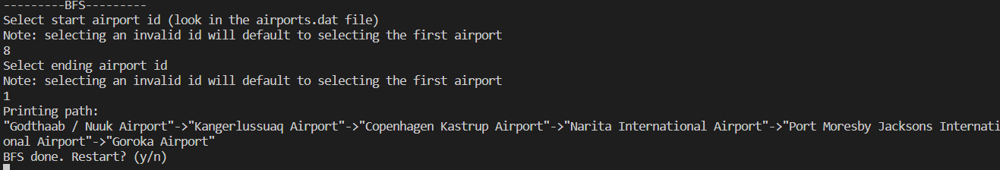
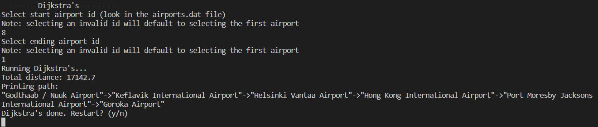
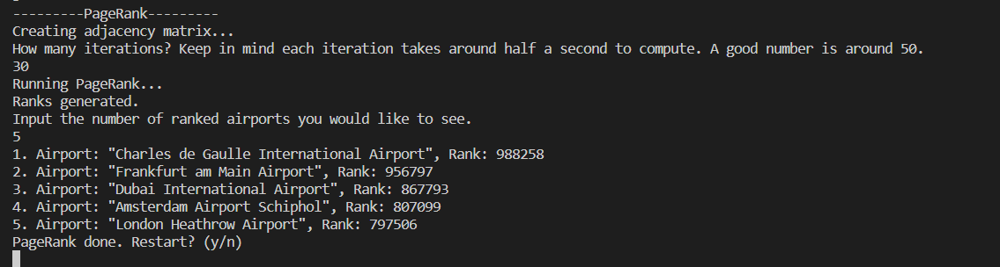

## Output and Correctness

Below are some sample output for the large scale operation of each of the three algorithms.

Note that BFS and Dijkstra’s differ for the same start and end, and PageRank top 5 airports are all international airports. This is a quick way to see that the algorithms are likely correct.

The correctness of each algorithm is further verified by the small test cases we made for BFS, dijkstra and pagerank algorithm. These test cases can be viewed by running the program. Be sure to read the instructions carefully.

## Answer to the leading question

1.  Parsing the data sets of routes and airport
2.  We use dijkstra and BFS traversal algorithms to find the shortest path between airports
3.  Implementation of pagerank algorithm to find the most important airport

For Dijkstra’s, we discovered how it works with large cases and we determined how to resolve bugs where it ran for way too long.

For pagerank, we have discovered the concept of dangling nodes, damping factor and random walk path. Dangling node is a web page with no forward link. Damping factor is the probability that is used to prevent airports with no outgoing routes. The typical damping factor is 0.85. If a damping factor of 1 is used, the airport we are looking at forever at the same one and we are in a sink. For a damping factor of 0 i used, then all airports are randomly reselected. We also randomly choose one node from the graph in the random walk method. After that, its neighbor will be visited and continue the iterations until the whole graph is covered.

In sum, our project is relatively successful in terms of all three algorithms(pagerank, BFS, and dijkstra) implementation and execution. We also implement multiple small test cases to ensure the correctness of these algorithms. However, we could further improve the output of the project by using make files instead of g++. We could also have visually graphed the flights and flight data. 
Besides, we did not have time to achieve our additional goal of visualizing the graph of the airport with coordinates and routes. If given more time, we will work as a team more to achieve this goal. 
